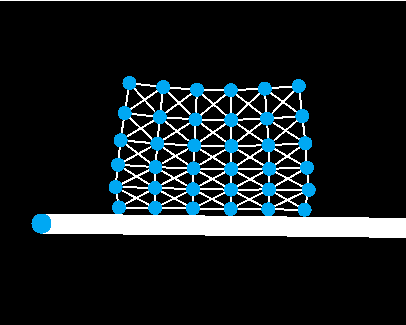

# Soft-Body-Simulation

C++/OpenGL soft body simulation program using my <a href="https://github.com/brock-eng/Legit-Game-Engine">2D Game Engine</a>.  Uses the <a href="https://en.wikipedia.org/wiki/Soft-body_dynamics#Spring/mass_models">spring/mass physics model</a> for approximating soft body behavior.  The program uses a generated mesh of nodes and springs, evaluating the net force vector produced on each node (due to springs & gravity) per rendering sequence.  Only after calculating all forces does the program apply corresponding velocity to each node.

Current simulation suffers from instability issues, especially when subjected to large force values that end up collapsing the mesh.  Improvements could be implemented that include an inner 'pressure' radiating outward from the center of the mesh granting an additional force that prevents nodes from collapsing inwards.

## References
<ul>
   <li><a href="https://www.youtube.com/watch?v=kyQP4t_wOGI">'But How DO Soft Body Simulations Work?'</a>- Youtube</li>
</ul>
